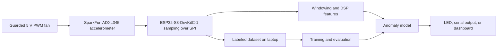

# Project 01: Edge Vibration Anomaly Monitor

## Problem

Motors and fans often change their vibration signature before a visible failure.
This project detects unusual vibration locally and explains which measured
features changed.

## Demo Goal

Run a small low-voltage motor or fan in two conditions:

- Normal operation
- A controlled abnormal condition, such as a safely added imbalance

The device should report an anomaly within one second without sending raw data to
the cloud.

## Proposed Architecture



## Selected Hardware

Milestone 1 selected a guarded 5 V fan rig that is easy to reproduce and safe to
run on a desk.

- [Exact bill of materials](hardware/BOM.md)
- [Test stand, wiring, sampling, and safety plan](hardware/TEST-STAND.md)

The starter sensor is intentionally affordable. Its bandwidth is sufficient to
learn the full acquisition and edge-inference workflow, but it is not an
industrial condition-monitoring instrument. The BOM records a higher-bandwidth
upgrade path for later comparison.

## Measurements That Matter

- Sampling rate and dropped-sample count
- Detection rate for each known abnormal condition
- False alarms during normal operation
- Time from fault introduction to detection
- Model flash, RAM, and inference latency
- Current draw during sampling and inference
- Effect of accelerometer mounting position

## Milestones

- [x] Create a software baseline that extracts vibration features.
- [x] Select hardware and document the exact BOM.
- [ ] Stream timestamped accelerometer samples to a laptop.
- [ ] Capture at least 20 normal and 20 abnormal runs.
- [ ] Publish an exploratory data analysis notebook or report.
- [ ] Train and compare a threshold baseline with an anomaly model.
- [ ] Deploy the selected detector to the ESP32-S3.
- [ ] Measure latency, memory, power, and false alarms.
- [ ] Publish a short demo video and final engineering report.

## First Prototype

The current prototype uses synthetic signals to verify the feature pipeline
before hardware arrives.

```bash
make demo
make test
```

The baseline intentionally starts with explainable signal features. An AI model
must beat this baseline on measured data before it earns a place in the device.
