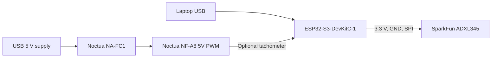

# Test Stand and Acquisition Plan

## Goal

Collect repeatable vibration windows from a small guarded fan without creating an
unsafe rotating imbalance. The first experiment should prove the acquisition
pipeline and reveal mounting sensitivity before any model is trained.

## Mechanical Setup

1. Install one fan grill on each side of the Noctua NF-A8 5V PWM.
2. Attach four identical rubber feet to the fan-frame corners, then place the fan
   horizontally on a stable desk with both grills installed and clear airflow
   above and below it.
3. Attach the ADXL345 breakout flat to the outside of one rigid corner of the fan
   frame using removable double-sided tape.
4. Mark the sensor position, axis orientation, and cable routing with a photo.
5. Add strain relief so jumper wires cannot reach either grill or pull on the
   sensor.

Keep this mounting unchanged for the first dataset. Later, repeat captures at a
second mounting position to measure how much placement changes the features.

## Safe Test Classes

Start with repeatable operating and mounting changes instead of modifying the
rotor:

| Label | How to produce it | What it tests |
| --- | --- | --- |
| `normal_fixed_speed` | Fan at one fixed PWM setting on the reference surface | Stable baseline |
| `normal_other_speed` | Fan at a second fixed PWM setting | Sensitivity to operating point |
| `mount_compliant` | Add a repeatable compliant pad below the guarded fan frame | Mounting and resonance shift |
| `surface_soft` | Move the unchanged fan onto a foam pad | Mounting and resonance shift |
| `airflow_restricted` | Place a fixed obstruction outside the intake grill without touching the fan | Load and airflow change |

Do not tape weights to blades, remove guards while running, touch the spinning
rotor, or operate a damaged fan.

## Electrical Architecture

The fan and development board use separate USB power sources. Use the NA-FC1 dial
to select repeatable low, medium, and high operating points. If the tachometer is
connected, confirm its electrical behavior and provide the correct pull-up and
level protection before connecting it to the ESP32-S3.

## Initial SPI Signal Plan

| Signal | Connection |
| --- | --- |
| `3V3` | ESP32-S3 3.3 V to ADXL345 supply |
| `GND` | Common ground between ESP32-S3 and ADXL345 |
| `SCLK` | ESP32-S3 GPIO12 to ADXL345 `SCL`/`SCLK` |
| `MOSI` | ESP32-S3 GPIO11 to ADXL345 `SDA`/`SDI` |
| `MISO` | ESP32-S3 GPIO13 from ADXL345 `SDO` |
| `CS` | ESP32-S3 GPIO10 to ADXL345 `CS` |
| `INT1` | ADXL345 data-ready interrupt to ESP32-S3 GPIO14 |

## Acquisition Target

- Interface: SPI
- Accelerometer output data rate: 3,200 Hz
- Axes: X, Y, and Z
- Window: 1,024 samples per axis, about 0.32 seconds
- First dataset: at least 20 windows for each safe test class
- File fields: timestamp, run ID, label, fan setting, mounting position, axis
  orientation, sample rate, dropped-sample count, and raw X/Y/Z samples

The first firmware milestone must report dropped samples. Data that cannot prove
its timing should not be used to claim model performance.

## Stop Conditions

Stop power immediately if:

- A grill, sensor, cable, or mounting point becomes loose
- Any wire can contact the rotating assembly
- The fan makes a scraping sound or visibly deforms
- A component or cable becomes unexpectedly hot
- Sample timing becomes unstable enough to invalidate the run

## Acceptance Criteria for First Capture

- A 60-second run completes without dropped samples.
- The recorded sample interval matches the configured output data rate within the
  limits of the timestamp method.
- The sensor orientation and mounting photo are saved with the run.
- Repeating the same condition produces similar RMS and frequency-domain peaks.
- Changing the surface or mounting produces a measurable feature difference.
